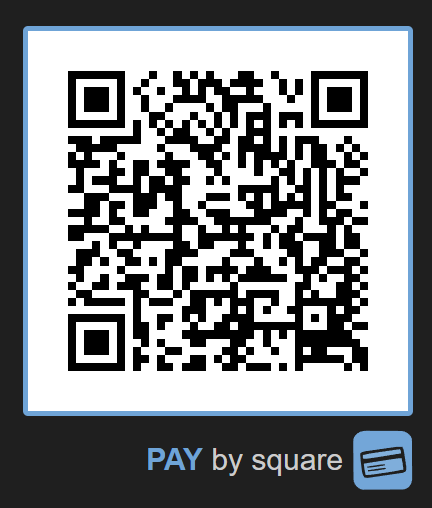

# PHP Pay by square
Umožňuje vytvárať jednoduché QR kódy pre slovenské platby Pay by square. Len prekopírujete na PHP hosting a máte hotovo :)


## Inštalácia
Na výber sú dve možnosti inštalácie:
- prekopírovanie na PHP hosting
- alebo ako mikroslužba cez Docker

Bez použitia dockera php skript funguje len na linuxových serveroch, pretože volá `/usr/bin/xz`. Taktiež PHP musí mať nainštalovaný modul `gd`. Testované s PHP 8 na Webhostingu Websupport.sk.
### Inštalácia na PHP hostingu
- nakopírujte obsah tohto repozitára na váš hosting
- hlavny súbor je `qr.php`, ktorý je potrebné zavolať s parametrami (viac nižšie)

### Inštalácia a spustenie pomocou Dockera
```bash
git clone https://github.com/slatinsky/php-pay-by-square
cd php-pay-by-square
docker build -t square .
docker run -p 8080:80 -d --name square-instance square
```
Služba je dostupná na localhoste na porte 8080 - `http://localhost:8080/qr.php?...`.

Zmeňte port `8080` v príkaze podľa potreby.

## Použitie na frontende
HTML:
```html

<br>

```

CSS:
```css
.qr-image {
    border: 5px solid #6FA4D7;
    max-width: 100%;
    width: 300px;
    height: auto;
    image-rendering: pixelated;
    image-rendering: -moz-crisp-edges;
    image-rendering: crisp-edges;
    padding: 20px;
    margin: 20px 0 0 0;
    border-radius: 5px;
}

.qr-image-square {
    max-width: 100%;
    width: 300px;
    margin: 0 20px 20px 0;
}
```

## Parametre pre qr.php
| **Parameter** | **Popis**                             | **Ukážka**               | **Obmedzenie**           |
|---------------|---------------------------------------|--------------------------|--------------------------|
| price         | Cena                                  | 5.01                     | Max 2 desatinné miesta   |
| note          | Poznámka k platbe                     | jozko+mrkvicka           | Max 35 znakov            |
| iban          | Číslo účtu (IBAN)                     | SK7700000000000000000000 | Bez medzier              |
| swift         | Bankový identifikačný kód (BIC/SWIFT) | CEKOSKBX                 |                          |
| vs            | Variabilný symbol                     | 00000002                 | Len čísla, max 10 znakov |
| ss            | Špecifický symbol                     | 2022                     | Len čísla, max 10 znakov |
| cs            | Konštantný symbol                     | 0000                     | Len čísla, max 4 znaky   |

Dátum splatnosti je automaticky nastavený na aktuálny deň

Ukážkový QR kód je na začiatku tohto `README.md` súboru

## FAQ
Nejde načítať QR kód v internet bankingu
- Ukážkový QR kód nefunguje pre každú banku, pretože niektoré overujú existenciu IBANu (a ukážkový IBAN SK7700000000000000000000 neexistuje). Vložte svoj vlastný IBAN a vyskúšajte znova :)

Nefunguje pre české účty
- v Česku sa používa iná špecifikácia pay by square, teda toto riešenie je možné použiť výlučne len pre slovenské účty.

## Poďakovanie
- [Ján Fečík](https://jan.fecik.sk/blog/qr-generator-platieb-pay-by-square-v-php/) za implementáciu algoritmu generovania reťazcov Pay by square v PHP, z ktorého bol tento projekt forknutý
- [Alexandre Assouad (t0k4rt)](https://github.com/t0k4rt/phpqrcode) za konverziu reťazcov na QR obrázky


## Licencia
GNU General Public License v3.0

Pull requesty sú vítané :)

Ak sa vám projekt páči, ohodnoťte ho hviezdičkou ⭐️
